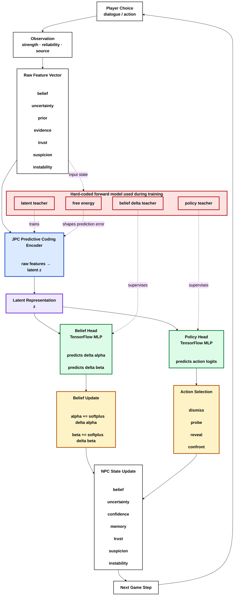

```mermaid
%%{init: {
  "theme": "base",
  "themeVariables": {
    "primaryTextColor": "#000000",
    "secondaryTextColor": "#000000",
    "tertiaryTextColor": "#000000",
    "lineColor": "#222222",
    "fontFamily": "Arial",
    "fontSize": "18px",
    "fontWeight": "bold",
    "nodeTextColor": "#000000"
  }
}}%%

flowchart TD

    A["Player Choice<br/>dialogue / action"]

    B["Observation<br/>strength · reliability · source"]

    C["Raw Feature Vector<br/><br/>
    belief<br/>
    uncertainty<br/>
    prior<br/>
    evidence<br/>
    trust<br/>
    suspicion<br/>
    instability"]

    D["JPC Predictive Coding Encoder<br/><br/>
    raw features → latent z"]

    E["Latent Representation<br/>z"]

    F["Belief Head<br/>TensorFlow MLP<br/><br/>
    predicts delta alpha<br/>
    predicts delta beta"]

    G["Policy Head<br/>TensorFlow MLP<br/><br/>
    predicts action logits"]

    H["Belief Update<br/><br/>
    alpha += softplus delta alpha<br/>
    beta += softplus delta beta"]

    I["Action Selection<br/><br/>
    dismiss<br/>
    probe<br/>
    reveal<br/>
    confront"]

    J["NPC State Update<br/><br/>
    belief<br/>
    uncertainty<br/>
    confidence<br/>
    memory<br/>
    trust<br/>
    suspicion<br/>
    instability"]

    K["Next Game Step"]

    %% =====================================================
    %% MAIN FLOW
    %% =====================================================

    A --> B
    B --> C
    C --> D
    D --> E

    E --> F
    E --> G

    F --> H
    G --> I

    H --> J
    I --> J

    J --> K
    K --> A

    %% =====================================================
    %% HARD-CODED FORWARD MODEL
    %% =====================================================

    subgraph M["Hard-coded forward model used during training"]

        M1["free energy"]

        M2["latent teacher"]

        M3["belief delta teacher"]

        M4["policy teacher"]

    end

    %% =====================================================
    %% TRAINING SIGNALS
    %% =====================================================

    C -. input state .-> M

    M2 -. trains .-> D

    M1 -. shapes prediction error .-> D

    M3 -. supervises .-> F

    M4 -. supervises .-> G

    %% =====================================================
    %% STYLING
    %% =====================================================

    classDef input fill:#ffffff,color:#000000,stroke:#222222,stroke-width:2px,font-weight:bold;
    classDef pc fill:#dbeafe,color:#000000,stroke:#1d4ed8,stroke-width:3px,font-weight:bold;
    classDef latent fill:#ede9fe,color:#000000,stroke:#6d28d9,stroke-width:3px,font-weight:bold;
    classDef mlp fill:#dcfce7,color:#000000,stroke:#15803d,stroke-width:3px,font-weight:bold;
    classDef update fill:#fef3c7,color:#000000,stroke:#b45309,stroke-width:3px,font-weight:bold;
    classDef model fill:#fee2e2,color:#000000,stroke:#b91c1c,stroke-width:3px,font-weight:bold;

    class A,B,C,J,K input;
    class D pc;
    class E latent;
    class F,G mlp;
    class H,I update;
    class M,M1,M2,M3,M4 model;
```
