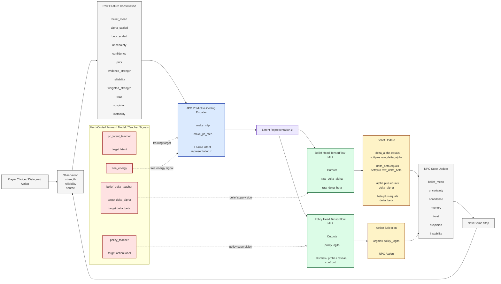

```mermaid
flowchart LR

    A["Player Choice / Dialogue / Action"]
    B["Observation<br/>strength<br/>reliability<br/>source"]

    A --> B

    C["Raw Feature Construction<br/><br/>
    belief_mean<br/>
    alpha_scaled<br/>
    beta_scaled<br/>
    uncertainty<br/>
    confidence<br/>
    prior<br/>
    evidence_strength<br/>
    reliability<br/>
    weighted_strength<br/>
    trust<br/>
    suspicion<br/>
    instability"]

    B --> C

    D["JPC Predictive Coding Encoder<br/><br/>
    make_mlp<br/>
    make_pc_step<br/><br/>
    Learns latent representation z"]

    C --> D

    E["Latent Representation z"]

    D --> E

    F["Belief Head TensorFlow MLP<br/><br/>
    Outputs<br/>
    raw_delta_alpha<br/>
    raw_delta_beta"]

    G["Policy Head TensorFlow MLP<br/><br/>
    Outputs<br/>
    policy logits<br/><br/>
    dismiss / probe / reveal / confront"]

    E --> F
    E --> G

    H["Belief Update<br/><br/>
    delta_alpha equals softplus raw_delta_alpha<br/>
    delta_beta equals softplus raw_delta_beta<br/><br/>
    alpha plus equals delta_alpha<br/>
    beta plus equals delta_beta"]

    F --> H

    I["Action Selection<br/><br/>
    argmax policy_logits<br/><br/>
    NPC Action"]

    G --> I

    J["NPC State Update<br/><br/>
    belief_mean<br/>
    uncertainty<br/>
    confidence<br/>
    memory<br/>
    trust<br/>
    suspicion<br/>
    instability"]

    H --> J
    I --> J

    J --> K["Next Game Step"]
    K --> B

    subgraph FM["Hard-Coded Forward Model / Teacher Signals"]

        FE["free_energy"]

        LT["pc_latent_teacher<br/><br/>
        target latent"]

        BT["belief_delta_teacher<br/><br/>
        target delta_alpha<br/>
        target delta_beta"]

        PT["policy_teacher<br/><br/>
        target action label"]

    end

    LT -. training target .-> D
    BT -. belief supervision .-> F
    PT -. policy supervision .-> G
    FE -. free energy signal .-> D

    classDef world fill:#f5f5f5,stroke:#333,stroke-width:1px;
    classDef pc fill:#dbeafe,stroke:#1e40af,stroke-width:2px;
    classDef latent fill:#ede9fe,stroke:#5b21b6,stroke-width:2px;
    classDef mlp fill:#dcfce7,stroke:#166534,stroke-width:2px;
    classDef update fill:#fef3c7,stroke:#92400e,stroke-width:2px;
    classDef forward fill:#fee2e2,stroke:#991b1b,stroke-width:2px;

    class A,B,C,J,K world;
    class D pc;
    class E latent;
    class F,G mlp;
    class H,I update;
    class FE,LT,BT,PT forward;
```
