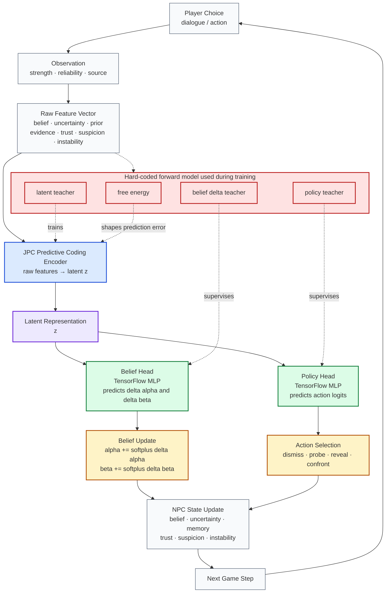

```mermaid
flowchart TD

    A["Player Choice<br/>dialogue / action"]
    B["Observation<br/>strength · reliability · source"]
    C["Raw Feature Vector<br/>belief · uncertainty · prior<br/>evidence · trust · suspicion · instability"]

    D["JPC Predictive Coding Encoder<br/>raw features → latent z"]
    E["Latent Representation<br/>z"]

    F["Belief Head<br/>TensorFlow MLP<br/>predicts delta alpha and delta beta"]
    G["Policy Head<br/>TensorFlow MLP<br/>predicts action logits"]

    H["Belief Update<br/>alpha += softplus delta alpha<br/>beta += softplus delta beta"]
    I["Action Selection<br/>dismiss · probe · reveal · confront"]

    J["NPC State Update<br/>belief · uncertainty · memory<br/>trust · suspicion · instability"]
    K["Next Game Step"]

    A --> B --> C --> D --> E
    E --> F --> H --> J
    E --> G --> I --> J
    J --> K --> A

    subgraph M["Hard-coded forward model used during training"]
        M1["free energy"]
        M2["latent teacher"]
        M3["belief delta teacher"]
        M4["policy teacher"]
    end

    C -.-> M
    M2 -. trains .-> D
    M3 -. supervises .-> F
    M4 -. supervises .-> G
    M1 -. shapes prediction error .-> D

    classDef input fill:#f8fafc,stroke:#475569,stroke-width:1px;
    classDef pc fill:#dbeafe,stroke:#1d4ed8,stroke-width:2px;
    classDef latent fill:#ede9fe,stroke:#6d28d9,stroke-width:2px;
    classDef mlp fill:#dcfce7,stroke:#15803d,stroke-width:2px;
    classDef update fill:#fef3c7,stroke:#b45309,stroke-width:2px;
    classDef model fill:#fee2e2,stroke:#b91c1c,stroke-width:2px;

    class A,B,C,J,K input;
    class D pc;
    class E latent;
    class F,G mlp;
    class H,I update;
    class M,M1,M2,M3,M4 model;
```
